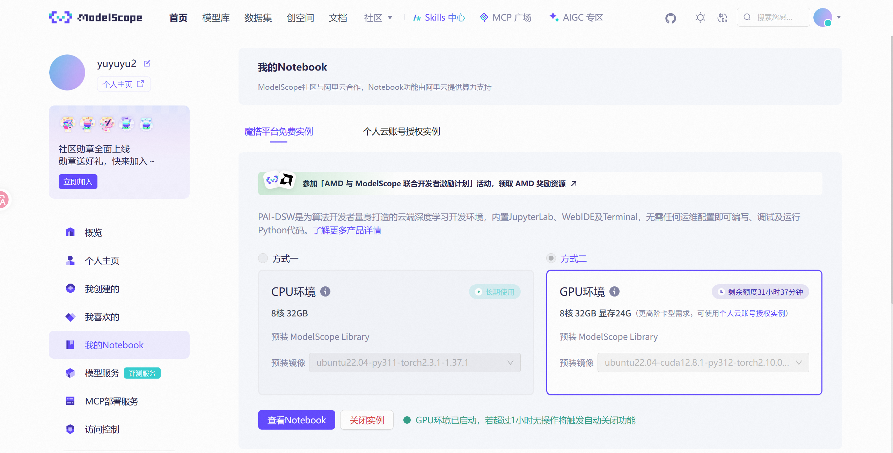
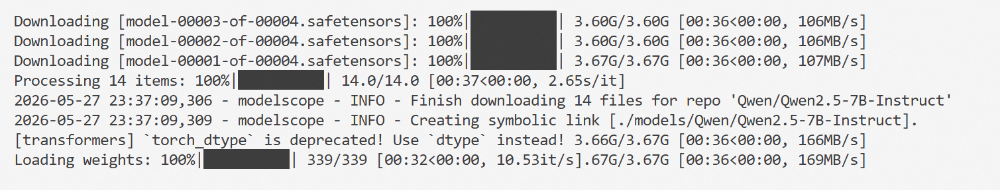
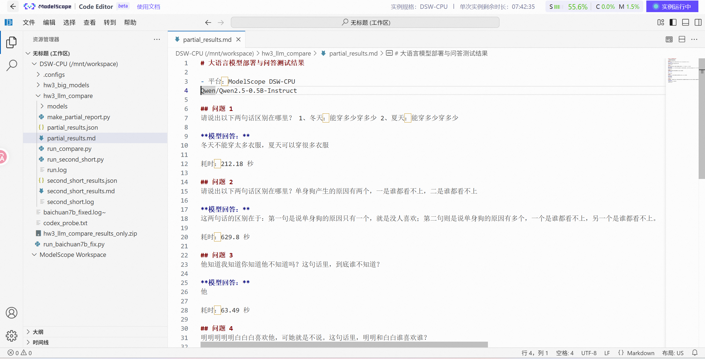
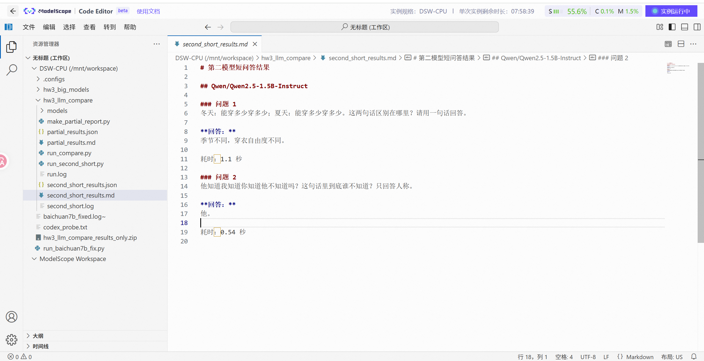
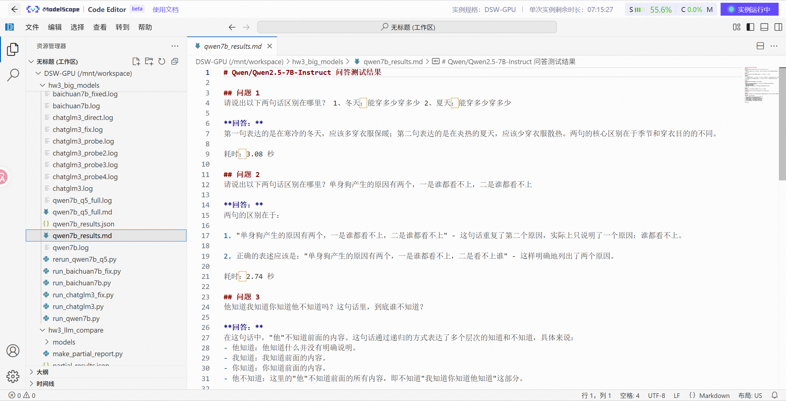
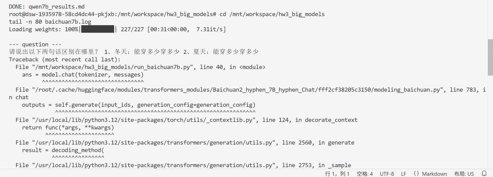

# 同济大学人工智能选修作业 3：大语言模型部署体验

本仓库用于提交人工智能选修课第三次作业，主题为在 ModelScope DSW 环境中部署并测试大语言模型。实验主要比较 Qwen2.5 系列不同参数规模模型在中文语义理解、歧义句判断和多义词解释任务上的表现，并记录 ChatGLM3-6B、Baichuan2-7B-Chat 在当前依赖环境下遇到的兼容性问题。

公开仓库链接：<https://github.com/yuyu-yu-yu/hw3-llm-modelscope>

## 实验概况

- 平台：ModelScope DSW
- CPU 环境：DSW-CPU，Python 3.11.11，PyTorch 2.3.1+cpu，transformers 4.55.4，modelscope 1.37.1
- GPU 环境：DSW-GPU，NVIDIA A10，显存约 23GB
- 工作目录：`/mnt/workspace/hw3_llm_compare` 与 `/mnt/workspace/hw3_big_models`
- 主要测试任务：中文歧义句、嵌套指代关系、多义词“意思”的语义解释

## 测试模型

| 模型 | 参数规模 | 运行环境 | 完成情况 |
| --- | --- | --- | --- |
| Qwen/Qwen2.5-0.5B-Instruct | 0.5B | DSW-CPU | 完成 5 题 |
| Qwen/Qwen2.5-1.5B-Instruct | 1.5B | DSW-CPU / DSW-GPU | 完成 2 题短测 |
| Qwen/Qwen2.5-7B-Instruct | 7B | DSW-GPU | 完成 5 题 |
| baichuan-inc/Baichuan2-7B-Chat | 7B | DSW-GPU | 下载和加载成功，推理阶段因依赖兼容问题失败 |
| ZhipuAI/chatglm3-6b | 6B | DSW-GPU | 下载成功，加载/推理阶段遇到多处 Transformers API 兼容问题 |

## 主要结论

1. 0.5B 模型部署成本低，但在复杂中文语义理解上容易只抓住表层信息。
2. 1.5B 模型响应速度明显更快，短问答更自然，但测试题数量较少，主要作为中间规模补充。
3. 7B 模型在 GPU 上推理速度可接受，中文语义理解和回答完整性最好，是本次实验综合表现最好的模型。
4. Baichuan2-7B-Chat 和 ChatGLM3-6B 的失败主要来自模型自定义代码与当前 transformers/PyTorch 环境不匹配，不是模型权重下载失败。

## 文件说明

- [`hw3_2451412_臧真宇.pdf`](./hw3_2451412_%E8%87%A7%E7%9C%9F%E5%AE%87.pdf)：最终实验报告。
- [`hw3_2451412_臧真宇.tex`](./hw3_2451412_%E8%87%A7%E7%9C%9F%E5%AE%87.tex)：实验报告 TeX 源文件。
- [`report_screenshots/`](./report_screenshots)：报告中使用的 ModelScope 实验截图。
- `tongji_cover_wordmark.png`、`tongji_header_wordmark.png`：报告封面和页眉使用的同济字样图片。

## 截图材料

### ModelScope GPU 实例

### Qwen2.5-7B 下载与权重加载

### Qwen2.5-0.5B 问答结果

### Qwen2.5-1.5B 问答结果

### Qwen2.5-7B 问答结果

### Baichuan2-7B 兼容性错误

## 说明

本仓库只包含本次实验的报告、截图和可公开材料，不包含课程提供的参考资料压缩包、临时解压目录或模型权重文件。
